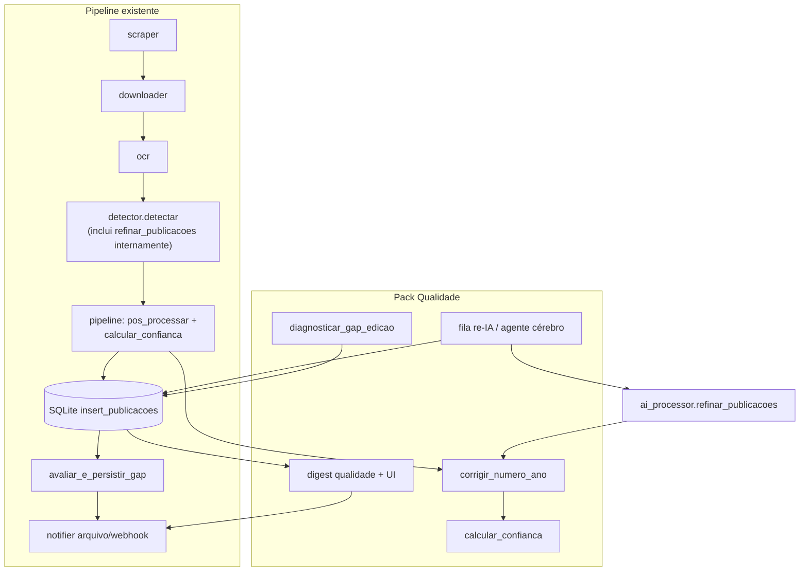

# Design: Cinco Funções de Qualidade (Pós-Auditoria)

| Campo | Valor |
|-------|--------|
| **Documento** | Qualidade automática — correção OCR, re-IA, confiança, gaps, superfície de alertas |
| **Projeto** | Bot-buscador-de-atos-publicados |
| **Autor** | _(preencher)_ |
| **Data** | 2026-07-13 |
| **Status** | Approved for implementation (rev. 4 — thresholds user: 85/55) |
| **Relacionados** | `AGENTS.md`, `detector.py`, `ai_processor.py`, `agente.py`, `inteligencia.py`, `database.py`, `webapp.py`, `notifier.py`, `scripts/_qualidade.py`, `scripts/_re_ia.py`, `scripts/_audit_deteccao.py`, `scripts/reprocessar_subdetectados.py` |

---

## Overview

O pipeline scraper → downloader → OCR → detector → AI → notifier já extrai e classifica atos oficiais de Inajá-PR a partir das edições do “O Regional Jornal”. Auditorias recentes e scripts de manutenção (`_qualidade.py`, `_audit_deteccao.py`, `_re_ia.py`) mostram gaps sistemáticos: números com ano OCR impossível (`095/2036`), ~25% das publicações sem `resumo_ia`, mistura de atos bons com lixo de OCR sem score de confiança, subdetecção (muitos hits de “Inajá” e poucas `publicacoes`), e ausência de um digest operacional diário após a remoção dos canais Telegram/Email.

Este design propõe **cinco funções de qualidade coesas**, implementadas por extensão dos módulos existentes (sem microserviços), com feature flags em `.env` / tabela `settings`, orquestração no **cérebro** do `agente.py`, persistência em SQLite via migrações versionadas, e superfície UI em `/operacao` + badges no dashboard. Notificações continuam **somente arquivo** (`alertas/YYYY-MM-DD.log`) e **webhooks opcionais**.

**Hook canônico de pós-processamento (rev. 3):** `qualidade.pos_processar_publicacoes` e `calcular_confianca` rodam no **`pipeline`**, imediatamente após `detectar(...)`, **antes** de `ai_explicacao_auto` e `insert_publicacoes`, com `edicao.data_publicacao` já em escopo — **sem** alterar a assinatura de `detector.detectar`. Merge de reprocess é **uma** história unificada (substitui dual-path com `_mesclar_ia_anterior`).

---

## Background & Motivation

### Estado atual (âncoras no código)

| Área | O que já existe | Limitação |
|------|-----------------|-----------|
| Número de ato | `detector._numero_ato_valido` (aceita 1990–2100); `_numero_confiavel` exige âncora `Nº`; `_resolver_numero_final` em `ai_processor.py` | Anos como **2036/2028** passam (comentário em L725: “OCR de 2026 ainda aceita”); sem âncora na **data da edição** |
| Checklist / qualidade | `inteligencia.montar_checklist_local` → score 0–100 de transparência; `_score_qualidade_pub` só para dedup | Checklist ≠ confiança de “é um ato real e bem extraído”; score de dedup **não é persistido** |
| Re-IA | `agente._pubs_fracas` seleciona até `min(5, remaining_hora)` depois **hard-slice `pubs[:3]`** (L699); `scripts/_re_ia.py`; `get_publicacoes_sem_ia` / `update_publicacao_ia` | Critério fraco (só resumo/valor); sem contador de tentativas; sem orçamento diário dedicado; `update_publicacao_ia` **não grava** importancia/checklist/anomalia/temas |
| Subdetecção | `listar_edicoes_so_mencao`, FN (`fn_sugestao`); cérebro reprocessa **1** só-menção **somente em modo cirurgião**; scripts `_audit_deteccao.py` (UNDER: hits≥3 ∧ pubs≤1) vs `reprocessar_subdetectados.py` (hits≥3 ∧ pubs≤max(1,hits//4), exige `.ocr.json`) | Heurísticas **divergentes**; runtime não cobre “1 pub com muitos hits” |
| Alertas | `notifier.notificar` → arquivo + webhook (payload edição: `publicacoes` = **int count**); resumo diário **IA** em settings (`resumo_diario_*`); `/operacao` tabs `automacao\|fila` | Sem digest de **contadores** de qualidade; Telegram/Email removidos (histórico `notificacoes.canal` pode conter valores legados — **não reativar**) |
| UI | Badges em `edicao.html` (IA, importância, anomalia, checklist); filtro `?tipo=` / `?mes=` no dashboard | Sem badge/filtro **alta / média / revisar** por confiança |

### Dores concretas

1. **OCR de ano**: dígitos 0↔6, 2↔8, 3↔8 geram `N/2036` em vez de `N/2026`; o sistema grava e exibe como se válido.
2. **Cobertura IA**: timeouts/500 da API deixam lote com `ia_processado=0` ou `resumo_ia` vazio; reprocessamento é manual.
3. **Triagem humana**: operador não sabe o que priorizar no dashboard (ato limpo vs. lixo).
4. **FN / under-detection**: menções e headers de prefeitura no `.txt` sem pubs equivalentes → dependência de force-OCR manual.
5. **Observabilidade operacional**: sem um painel + log diário consolidando filas de qualidade (separado do resumo narrativo da IA).

---

## Goals & Non-Goals

### Goals

1. Corrigir automaticamente anos/números OCR absurdos quando houver hipótese de confusão de dígito alinhada à data da edição; **não** corrigir se o nº estiver ancorado no trecho com marcador `Nº`; marcar revisão quando incerto.
2. Manter fila de re-IA no cérebro do agente, com critérios amplos, limites horários **e** diários, e anti-loop de tentativas; expandir `update_publicacao_ia` para campos de inteligência + qualidade.
3. Calcular e persistir **score de confiança 0–100** + nível (`alta` \| `media` \| `revisar`) por publicação; expor badge e filtro na UI.
4. Detectar gaps menções/headers × publicações com heurística canônica; persistir candidatos e (opcionalmente) enfileirar redetecção/force-OCR sob orçamento OCR/lock existentes.
5. Publicar digest diário de **contadores** em `alertas/` (independente do resumo IA) e superfície Admin/Operação; enriquecer webhook de forma **não-breaking**.

### Non-Goals

- Não reintroduzir Telegram, Email nem bots de chat. Valores históricos em `notificacoes.canal` (`telegram`/`email`) são legado de leitura apenas.
- Não reescrever o OCR Tesseract/pdfplumber nem o layout de colunas.
- Não criar serviço separado de filas (Redis/Celery); SQLite + jobs existentes bastam.
- Não treinar ML custom; confiança é **heurística determinística** (com pesos documentados).
- Não alterar a assinatura de `detector.detectar` nesta iniciativa (hook no `pipeline`).
- Não forçar re-OCR de todas as edições históricas no rollout (backfill opt-in).
- Não mudar o tipo de `payload["publicacoes"]` no webhook (permanece **int**).

---

## Proposed Design

### Arquitetura lógica



Novo módulo preferencial: **`qualidade.py`** na raiz do projeto (espelha o papel de `inteligencia.py` — lógica de domínio pura, sem HTTP). Scripts `_qualidade.py` / `_re_ia.py` / `_audit_deteccao.py` / `reprocessar_subdetectados.py` passam a ser **wrappers CLI finos** sobre funções de `qualidade.py`.

### Sequência no processamento de edição (canônica)

> **Nota de fidelidade ao código:** `refinar_publicacoes` é invocado **dentro** de `detector.detectar` hoje (não é estágio separado do pipeline). O diagrama abaixo reflete isso. Pós-processamento de qualidade **não** entra em `detectar` (que não recebe `data_publicacao`).

```mermaid
sequenceDiagram
  participant P as pipeline
  participant Det as detector.detectar
  participant AI as ai_processor
  participant Q as qualidade
  participant DB as database
  participant Ag as agente.run_cerebro

  Note over P: Reprocess: snapshot DB antes (merge unificado)
  Note over Det,AI: Hoje: IA é chamada dentro de detectar
  P->>Det: (edicao_id, titulo, paginas)
  Det->>AI: refinar_publicacoes(pubs brutas)
  AI-->>Det: refinadas + stats
  Det-->>P: DetectionResult (frozen; pubs = list[dict] mutáveis)
  P->>Q: pos_processar + confianca (data_publicacao)
  Note over Q: corrige numero; muta dicts; replace(DetectionResult)
  P->>AI: ai_explicacao_auto opcional (muta dicts in-place)
  Note over P: Merge unificado mescla snapshot → pubs (IA + feedback)
  P->>DB: insert_publicacoes (DELETE+INSERT; campos já no dict)
  P->>DB: salvar_metricas_deteccao
  P->>Q: avaliar_e_persistir_gap(edicao_id)
  Q->>DB: UPDATE edicoes gap_*
  P->>P: notificar (payload não-breaking)

  Note over Ag: Ciclo cérebro — update path (sem DELETE)
  Ag->>DB: listar_candidatas_re_ia JOIN edicoes.data_publicacao
  Ag->>AI: refinar_publicacoes (orçamento multi-camada)
  Ag->>Q: pos_processar + confianca
  Ag->>DB: update_publicacao_ia(registrar_tentativa=True)
  Ag->>Q: digest se virada de dia
```

**Ordem canônica no pipeline** (`_processar_edicao_unlocked` e `reprocessar_deteccao_de_cache`):

```text
1. [reprocess only] snapshot = merge.carregar_anteriores(edicao_id)   # SELECT * publicacoes
2. resultado = detectar(...)                                          # IA inside
3. resultado = _aplicar_qualidade_pos_deteccao(resultado, data_pub)  # pos_processar + confianca
4. [optional] ai_explicacao_auto: muta cada pub dict in-place         # NÃO re-wrap se já mutou lista
5. pubs = merge.aplicar(resultado.publicacoes, snapshot)              # unificado; ver Feature 4
6. resultado = replace(resultado, publicacoes=pubs)
7. insert_mencoes / insert_publicacoes / métricas / gap / notificar
```

> `DetectionResult` é `frozen=True`, mas `publicacoes` é uma `list[dict]` cujos dicts são **mutáveis**. `_aplicar_qualidade_pos_deteccao` deve: (a) mutar os dicts **ou** produzir nova lista e `replace(resultado, publicacoes=...)`. A explicação auto atual itera `resultado.publicacoes` e seta `explicacao_ia` in-place — por isso qualidade deve rodar **antes** da explicação (campos nº/confiança estáveis no texto de contexto) e **não** descartar a lista de dicts já referenciada sem `replace` coerente.

**Call sites obrigatórios** (checklist de implementação):

| Local | Path | O que fazer |
|-------|------|-------------|
| `pipeline._processar_edicao_unlocked` | full OCR | ordem 2→7 acima (snapshot vazio se 1ª vez) |
| `pipeline.reprocessar_deteccao_de_cache` | cache | snapshot + merge unificado; **remover** call solta a `_mesclar_ia_anterior` |
| `agente.run_cerebro` re-IA | UPDATE | `update_publicacao_ia` + quality; **não** `insert_publicacoes` |
| `scripts/_re_ia.py` | UPDATE | idem cérebro |
| `webapp.refinar_ia_manual` → `_refinar` | hoje DELETE+INSERT | **Preferido:** loop `update_publicacao_ia` + pos_processar/confianca por pub (como cérebro). **Proibido** continuar com `insert_publicacoes(edicao_id, refinadas)` sem merge — apaga feedback. Ver Feature 2. |

**Re-IA:** sempre obter `data_publicacao` da edição (JOIN ou SELECT) antes de `pos_processar` / `calcular_confianca`.

---

### Feature 1 — Correção automática de número/ano pós-OCR

#### Problema

`_numero_ato_valido` (detector L704–738) normaliza `N/AAAA` mas aceita qualquer ano ∈ [1990, 2100]. Casos reais: `095/2036`, `320/2028`, `028/2028` onde a edição é 2026.

#### Abordagem

```python
# qualidade.py (novo)
@dataclass
class CorrecaoNumero:
    numero_original: str | None
    numero_final: str | None
    corrigido: bool
    confianca_correcao: float  # 0.0–1.0
    motivo: str  # ex.: "ano_futuro_ocr:2036→2026" | "ano_futuro_ancorado"
    precisa_revisao: bool

def corrigir_numero_ano(
    numero: str | None,
    *,
    data_publicacao_edicao: str | None,  # ISO YYYY-MM-DD
    data_documento: str | None = None,
    trecho: str = "",
    texto_corrigido: str = "",
    ano_max_futuro: int = 1,
) -> CorrecaoNumero:
    ...
```

**Regras (ordem):**

1. Sanitizar com `detector._numero_ato_valido` (reuso).
2. Se sem `/` ou sem ano de 4 dígitos → retornar como está (`corrigido=False`).
3. Obter `ano_ref` = ano de `data_publicacao_edicao`, fallback ano de `data_documento`, fallback `date.today().year`.
4. Se `ano_num <= ano_ref + ano_max_futuro` e `ano_num >= 1990` → OK (`corrigido=False`, `precisa_revisao=False`).
5. Se `ano_num > ano_ref + ano_max_futuro`:
   1. **5a — Âncora no trecho (obrigatório, não open question):** blob = `trecho` + `\n` + `texto_corrigido` (e `resumo_ia` se útil). Se `detector._numero_ancorado_no_texto(numero_original_sanitizado, blob)` → **não corrigir** (`corrigido=False`), flag `ano_futuro_ancorado`, `precisa_revisao=True` (ex.: PME 2026–2036 com `Nº …/2036` legítimo no OCR).
   2. **5b — Candidatos OCR de 1 dígito** no ano com mapa:
      - `0↔6`, `0↔8`, `0↔9`, `1↔7`, `2↔7`, `2↔8`, `3↔8`, `3↔9`, `5↔6`, `5↔8`, `8↔9`
      - Preferir candidato com `abs(ano_cand - ano_ref)` mínimo e `ano_cand ∈ [ano_ref - 15, ano_ref + ano_max_futuro]`.
      - Se um único candidato claramente melhor (distância ≤ 1 do `ano_ref` e 1 dígito de diferença) → **aplicar** (`corrigido=True`, `confianca_correcao ≥ 0.8`).
      - Se empate ou nenhum → manter original **ou** `None` se `ano_num > ano_ref + 10`; `precisa_revisao=True`.
6. Opcional (fase 2): re-extrair com `_extrair_numero_preferencial` se o trecho tiver forma coerente.

**Integração (única):**

```python
# pipeline.py — helper interno
def _aplicar_qualidade_pos_deteccao(resultado: DetectionResult, data_publicacao: str | None) -> DetectionResult:
    if not SETTINGS.quality_fix_numero_ano and not SETTINGS.quality_confianca:
        return resultado
    pubs = qualidade.pos_processar_publicacoes(
        list(resultado.publicacoes),
        data_edicao=data_publicacao,
    )
    # DetectionResult is frozen → replace publicacoes (dicts mutáveis na lista nova/mesma)
    return replace(resultado, publicacoes=pubs)
```

- **Não** chamar de dentro de `detectar`.
- **Ordem:** `detectar` → **este helper** → `ai_explicacao_auto` → merge (se reprocess) → `insert_*`.
- Re-IA / CLI / webapp usam o mesmo `pos_processar_publicacoes` + data da edição.
- Flags em coluna JSON `flags_qualidade` (lista de strings/objetos).
- Correção de `numero` aqui implica que merge multi-key **deve** incluir K2 (sem numero) — ver Feature 4.

**Config:**

| Env / Settings field | Default | Uso |
|----------------------|---------|-----|
| `QUALITY_FIX_NUMERO_ANO` / `quality_fix_numero_ano` | `true` | Liga correção |
| `QUALITY_ANO_MAX_FUTURO` / `quality_ano_max_futuro` | `1` | Anos além da edição ainda aceitos sem correção |

**Testes (mínimo):**

| Entrada | data_edicao | trecho | Esperado |
|---------|-------------|--------|----------|
| `095/2036` | 2026-07-01 | sem âncora N° | `095/2026`, corrigido |
| `12/2025` | 2026-07-01 | — | sem mudança |
| `1/1999` | 2026-07-01 | — | sem “pulo” para 2026 |
| `089/2036` | 2026-06-01 | `Nº 089/2036` ancorado | sem correção; flag `ano_futuro_ancorado`; `precisa_revisao` |

**Risco (médio):** correção errada de ato futuro legítimo. Mitigação: passo 5a; `ano_max_futuro=1`; nunca alterar sequência, só ano.

---

### Feature 2 — Fila automática de re-IA (cérebro)

#### Problema

Hoje: `_pubs_fracas` puxa até `min(5, remaining_hora)` pubs sem `resumo_ia` **ou** sem `valor`; depois `refinar_publicacoes(pubs[:3])` (L699). `update_publicacao_ia` grava só um subconjunto de campos. Não há `ia_tentativas` nem teto diário de re-IA.

#### Tipos “genéricos” (definição fechada)

Para prioridade re-IA e score de confiança, **tipo genérico** = após `normalizar_tipo_ato` (ou strip), casefold em:

```text
{"", "ato", "atos", "outros", "outro", "termo", "publicacao", "publicação", "n/a", "na", "nao identificado", "não identificado"}
```

#### Abordagem

`qualidade.listar_candidatas_re_ia(limit, *, criterios)` — cérebro + CLI.

**Critérios de candidatura (OR, com pesos):**

| Condição | Peso prioridade |
|----------|-----------------|
| `resumo_ia` vazio | +20 |
| `tipo` vazio / genérico (def. acima) | +15 |
| `orgao` vazio | +12 |
| `valor` vazio **e** tipo exige valor (contrato/extrato/dispensa/homolog/aditivo/pregão) | +10 |
| `ia_processado = 0` | +8 |
| `confianca_nivel = 'revisar'` e sem resumo | +5 |
| `ia_tentativas >= QUALITY_RE_IA_MAX_TENTATIVAS` **ou** `ia_status='esgotado'` | **exclui** |
| `trecho` vazio (após fallback assunto/texto_corrigido) | **exclui** |

#### Algoritmo de orçamento multi-camada (obrigatório)

Espelhar padrões `_K_IA_HORA` / `_K_OCR_DIA`:

| Settings key | Env | Default |
|--------------|-----|---------|
| `_K_RE_IA_DIA = "agente_re_ia_dia"` | valor `YYYYMMDD:count` | — |
| | `AGENTE_MAX_RE_IA_POR_CICLO` | 5 (substitui hardcode `[:3]`) |
| | `AGENTE_MAX_RE_IA_POR_DIA` | 40 |
| | `AGENTE_MAX_IA_POR_HORA` | 15 (existente) |
| | `AI_MAX_CALLS_POR_CICLO` | 80 (existente; respeitado por `refinar_publicacoes`) |
| | `QUALITY_RE_IA_MAX_TENTATIVAS` | 3 |

```text
remaining_hora = max(0, AGENTE_MAX_IA_POR_HORA - _ia_calls_hora())
remaining_dia  = max(0, AGENTE_MAX_RE_IA_POR_DIA - _re_ia_calls_hoje())

# AI_MAX_CALLS_POR_CICLO é um teto de *batch* para o lote do cérebro, não fairness
# process-wide. Hoje o cérebro chama reset_ai_call_counter() no início do bloco re-IA;
# após o reset, o contador interno do ai_processor volta a 0, então
#   remaining_ai ≈ AI_MAX_CALLS_POR_CICLO (cheio)
# e o min(...) abaixo NÃO enxerga calls de outras threads (ex. webapp _refinar).
# O corte real mid-batch continua em refinar_publicacoes → _pode_chamar_ia.
# Portanto: usar AI_MAX só como cap de tamanho de lote, não como orçamento global.

batch_cap = AGENTE_MAX_RE_IA_POR_CICLO
if AI_MAX_CALLS_POR_CICLO > 0:
    batch_cap = min(batch_cap, AI_MAX_CALLS_POR_CICLO)

limit = min(batch_cap, remaining_hora, remaining_dia)
# se limit == 0 → skip re_ia

# Ordem recomendada no cérebro:
#   1) calcular limit (acima)
#   2) reset_ai_call_counter()   # isola o lote; não afeta hora/dia do agente
#   3) refinar_publicacoes(pubs[:limit])
```

**Contagem de tentativa de IA — dono único:**

| Contador | Dono | Quando |
|----------|------|--------|
| `_inc_ia_calls(1)` / hora | **agente** (ou CLI) ao despachar cada pub/lote | attempt |
| `_inc_re_ia_dia(1)` | **agente** (ou CLI) | attempt |
| `ia_tentativas` na row | **somente** `database.update_publicacao_ia(..., registrar_tentativa=True)` via SQL `ia_tentativas = COALESCE(ia_tentativas,0)+1` | dentro do UPDATE, 1× por chamada |

- O caller **não** pré-incrementa `pub["ia_tentativas"]` nem faz `+= 1` em Python além do UPDATE.
- Se o UPDATE não rodar (crash antes), a tentativa de hora/dia já contou (aceitável; evita retry storm sem custo de API se falhar antes da API — opcionalmente só incrementar hora/dia **após** retorno de `refinar_publicacoes`; preferência: incrementar hora/dia no mesmo ponto em que se chama `update_publicacao_ia`, i.e. **após** attempt de refine por pub retornada).
- Preferência final: para cada pub em `refinadas` (e candidatas que falharam no lote se rastreáveis): `update_publicacao_ia(p, registrar_tentativa=True)` + `_inc_ia_calls(1)` + `_inc_re_ia_dia(1)`.

`AGENTE_MAX_RE_IA_POR_DIA` é **independente** do orçamento OCR diário (`AGENTE_MAX_OCR_POR_DIA`).

#### `update_publicacao_ia` expandido (contrato SQL)

Substituir a implementação atual por UPDATE que cubra refine + qualidade. Regras:

| Coluna | Política |
|--------|----------|
| `orgao`, `tipo`, `numero`, `data_documento`, `assunto`, `valor` | `COALESCE(?, col)` — não apagar com NULL da IA |
| `resumo_ia`, `categoria_ia`, `texto_corrigido` | set direto se presente no dict; senão COALESCE |
| `ia_processado` | `1` se houve attempt bem-sucedida de parse; senão manter |
| `importancia`, `importancia_motivo`, `notificar_ia` | COALESCE / set se IA retornou |
| `explicacao_ia` | COALESCE |
| `partes_ia`, `checklist_ia`, `temas`, `validacao_ia` | JSON dump se dict/list; COALESCE se None |
| `anomalia`, `anomalia_motivo` | set se chave presente |
| `confianca`, `confianca_nivel`, `confianca_detalhe`, `flags_qualidade` | set após `calcular_confianca` / pos_processar |
| `ia_tentativas` | **somente se** `registrar_tentativa=True`: SQL `COALESCE(ia_tentativas,0)+1`. Caller **não** envia valor absoluto. |
| `ia_status` | `'ok'` \| `'pendente'` \| `'esgotado'` (calculado no UPDATE se tentativas ≥ max e ainda fraca) |
| `feedback`, `feedback_em` | **nunca** sobrescrever em re-IA |

```python
def update_publicacao_ia(pub: dict, *, registrar_tentativa: bool = False) -> None:
    ...
```

Teste obrigatório: re-IA com JSON parcial não zera `importancia` pré-existente; grava `confianca`; **um** incremento de `ia_tentativas` por chamada com `registrar_tentativa=True`.

#### Webapp `_refinar` (call site obrigatório)

Hoje `webapp.refinar_ia_manual` → `_refinar` faz `refinar_publicacoes` + **`insert_publicacoes`** (DELETE+INSERT da edição inteira) — apaga `feedback` e ignora qualidade.

**Comportamento alvo (PR3):**

```python
def _refinar():
    data_pub = ...  # SELECT data_publicacao FROM edicoes
    pubs = [dict(r) for r in publicacoes_rows]  # mantêm id
    refinadas, stats = refinar_publicacoes(pubs)
    for p in refinadas:
        if not p or not p.get("id"):
            continue
        qualidade.pos_processar_publicacoes([p], data_edicao=data_pub)
        # confianca preenchida no dict
        database.update_publicacao_ia(p, registrar_tentativa=True)
    # NÃO chamar insert_publicacoes aqui
```

Se no futuro alguém precisar re-insert (reordenação), obrigatório passar pelo **merge unificado** (Feature 4).

#### Matriz de modos do cérebro

| Modo | OCR pendentes | Re-IA | Gap scan | Gap reprocess (se `QUALITY_GAP_AUTOREPROCESS`) | Digest |
|------|---------------|-------|----------|-----------------------------------------------|--------|
| `sentinela` | não | não | não | não | não (só observa) |
| `escudo` | não | não | não | não | não |
| `formiga` | sim (orçamento OCR) | sim | sim (detect only ok) | não (default) | sim 1×/dia |
| `cirurgiao` | limitado (1) | sim | sim | sim se flag + lock/OCR ok | sim 1×/dia |
| `auto` | resolve via `resolver_modo_auto` | conforme modo efetivo | conforme | conforme | sim |

**Gap force-OCR / redetect:** reutilizar `_motivo_pular_ocr_cerebro`, `_pode_ocr`, `_inc_ocr_calls` — **não** contornar o orçamento OCR diário nem o lock.

#### Espelhamento `atos_arquivo` após re-IA

**Decisão (PR3):** **não** re-espelhar por padrão (`QUALITY_RE_IA_ESPELHAR=false`). Motivo: re-IA atual já não chama `espelhar_edicao`; espelho completo é I/O pesado. Opt-in: se flag true e (`numero`|`resumo_ia`|`confianca_nivel`) mudou, chamar `atos_arquivo.espelhar_edicao` para a edição afetada (batch dedup por `edicao_id`).

**Backfill CLI:** `python scripts/_re_ia.py --mes 2026-07 --limite 20` → mesma API.

---

### Feature 3 — Score de confiança + badge UI

#### Problema

Checklist de transparência e importância medem eixos diferentes. Falta um score único “posso confiar neste registro?”.

#### Função pura — componentes com teto

```python
def calcular_confianca(pub: dict, *, data_edicao: str | None = None) -> dict:
    """
    Retorna {
      "score": int,           # clamp 0–100
      "nivel": "alta"|"media"|"revisar",
      "componentes": {str: int},  # cada um já clampado ao max do critério
      "motivos": [str, ...],
      "overrides": [str, ...],    # se nivel forçado
    }
    """
```

| Componente key | Max | Pontuação (floor 0) |
|----------------|-----|---------------------|
| `numero` | 20 | 0 se inválido/ausente; 12 se `_numero_ato_valido` OK sem ano; 20 se tem `N/AAAA` válido **e** ano coerente com edição (≤ ano_ref+max_futuro); 8 se número OK mas `precisa_revisao` / flag ano |
| `orgao` | 20 | 20 se órgão Inajá (prefeitura/município/câmara/conselho + inajá); 8 se órgão genérico não-vizinho; 0 se vazio; **0** se vizinho (não “−20” — floor 0) + motivo |
| `resumo_ia` | 15 | 15 se não vazio; 0 senão |
| `tipo` | 15 | 15 se normalizado e **não** genérico; 5 se genérico não vazio; 0 se vazio |
| `data_coerente` | 15 | 15 se `data_documento` parseável e ano ∈ [ano_ref−15, ano_ref+1]; 8 se data ausente mas número com ano coerente; 0 se data/ano conflitantes absurdos |
| `validacao` | 10 | 10 se `validacao_ia.ok` ou ausente; 5 se flags leves; 0 se flags graves / vizinho |
| `trecho` | 5 | 5 se `len(trecho)≥80`; 2 se 20–79; 0 se &lt;20 |

**Soma** dos componentes → `raw`; `score = max(0, min(100, raw))`.

**Ano coerente no componente `numero`:** usa a mesma noção de `ano_ref` da Feature 1; **não** soma pontos extras fora da tabela (sem double-count com `data_coerente` — `data_coerente` olha `data_documento`; `numero` olha o ano do nº).

**Nível por threshold (depois do score)** — decisão do usuário (rev. 4, mais rigoroso):

| Nível | Condição score | Defaults env |
|-------|----------------|--------------|
| `alta` | ≥ **85** | `QUALITY_CONFIANCA_ALTA_MIN=85` / `quality_confianca_alta_min` |
| `media` | **55–84** | `QUALITY_CONFIANCA_MEDIA_MIN=55` / `quality_confianca_media_min` |
| `revisar` | &lt; **55** | — |

**Overrides (aplicados depois; ordem de prioridade, primeiro vence para forçar `revisar`):**

1. `feedback == 'errado'` → `nivel='revisar'` (score inalterado ou min(score, 50))
2. flag `precisa_revisao` / `ano_futuro_ancorado` em `flags_qualidade` → `revisar`
3. `anomalia == 1` e motivo contém termos críticos (`valor`, `outlier`, `inconsist`) → `revisar`
4. `feedback == 'correto'` → boost opcional `score = min(100, score+10)` e se score≥**85** → `alta` (não remove override 2–3)

#### Fixtures douradas (golden) — expectativas estáveis para testes

| # | Pub resumida | score≈ | nivel |
|---|--------------|--------|-------|
| G1 | Decreto 10/2026, Prefeitura Inajá, resumo IA, data 01/06/2026, trecho 200c, ed 2026 | 90–100 | **alta** (≥85) |
| G2 | Contrato sem número, órgão Inajá, resumo, valor, trecho ok | 65–80 | **media** (55–84; sem nº completo dificilmente ≥85) |
| G3 | tipo=Outros, sem resumo, sem órgão, trecho curto | 0–25 | **revisar** (&lt;55) |
| G4 | número 095/2036 corrigido→2026, resto ok | 85–95 | **alta** se score≥85; se 80–84 → media (fixture deve mirar ≥85) |
| G5 | número 089/2036 ancorado, precisa_revisao | override | **revisar** (override 2) |
| G6 | órgão município vizinho (se chegar aqui) | baixo orgão+validação | **revisar** |
| G7 | só menção estruturada fraca: tipo Ato, sem nº | &lt;55 | **revisar** |
| G8 | extrato completo + checklist ok + validacao ok | ≥85 | **alta** (mirar score≥85 no fixture) |

#### Distinção de conceitos

| Campo | Significado |
|-------|-------------|
| `importancia` (1–5) | Relevância política/financeira para **notificar** |
| `checklist_ia.score` | Completude de transparência (nº, data, valor…) |
| `confianca` (novo) | Confiabilidade da **extração** |

#### UI (detalhe implementável)

**PR5a — badges + filtro (deps só PR2):**

- `templates/edicao.html`: badge após importância:
  - `item.confianca_nivel == 'alta'` → classe `badge-conf-alta` texto “Confiança alta”
  - `media` / `revisar` análogos; `title="{{ item.confianca }}/100"`
- `templates/dashboard.html` cards: mesmo badge compacto se `item.confianca_nivel`.
- `webapp.dashboard`: query `confianca: str = Query("")`; se valor em `{alta,media,revisar}`:
  ```sql
  AND LOWER(COALESCE(p.confianca_nivel, '')) = ?
  ```
  Template vars: adicionar `"confianca": confianca_f` ao context; chips de filtro espelhando `tipo`.
- `static/styles.css`: `.badge-conf-alta|media|revisar`.

**PR5b — operação + digest** (ver Feature 5).

#### Recalcular

- Pipeline pós-`detectar` (antes insert).
- Após re-IA.
- Após feedback humano (endpoint existente `/publicacoes/{id}/feedback` → recalcular).
- CLI: `python scripts/_qualidade.py --modo confianca --recalcular`.

---

### Feature 4 — Detector de gap (menções × pubs)

#### Problema

Dois scripts offline divergem; o cérebro só reprocessa **só-menção** (0 pubs) em **cirurgião**.

#### Heurística canônica `diagnosticar_gap_edicao`

**Fonte de hits:** arquivo `.txt` irmão do PDF (`caminho_local`) ou `texto_extraido_path` (igual scripts). Normalização sem acentos; regex `inaja|inava` para hits; headers `prefeitura municipal de ina|municipio de ina|camara municipal de ina`.

**Modo / fórmulas** (`QUALITY_GAP_MODE`):

| Mode | Env default | Fórmulas que marcam gap (OR) |
|------|-------------|------------------------------|
| `reprocess` | **default runtime** | (a) `hits >= H and n_pub <= max(1, hits // 4)`<br>(b) `headers >= 2 and n_pub < max(1, headers // 2)`<br>(c) `hits >= 2 and n_pub == 0`<br>Para **candidatura a reprocess auto**: preferir existência de `.ocr.json` (como `reprocessar_subdetectados`); sem cache → `acao=force_ocr` se severidade ≥ under |
| `audit` | CLI `_audit_deteccao` | (a′) `hits >= H and n_pub <= P` com `P=QUALITY_GAP_MAX_PUBS` default **1**<br>(b′) `headers >= 2 and n_pub < headers // 2` → LOW<br>Compatível com relatório UNDER/LOW atual |

Knobs: `QUALITY_GAP_MIN_HITS` H=3; `QUALITY_GAP_MAX_PUBS` P=1 (só mode `audit`); `QUALITY_GAP_MODE=reprocess|audit`.

**Severidade / ação:**

| Condição | severidade | acao_sugerida |
|----------|------------|---------------|
| mode hit + `n_pub==0` | `under` | `redetect_cache` se ocr.json else `force_ocr` |
| mode hit + `n_pub>=1` | `under` | idem |
| headers rule only | `low` | `redetect_cache` |
| `paginas_ocr_fraco / paginas_total >= 0.4` e hits≥H | `critical` | `force_ocr` |
| nenhum | `none` | `none` |

`score_gap` (0–100): função monotônica de `hits - n_pub*3`, headers, e critical boost — detalhe na implementação; usado só para ordenar fila.

CLI:

- `scripts/_audit_deteccao.py` → `QUALITY_GAP_MODE=audit` (print tabela).
- `scripts/reprocessar_subdetectados.py` → mode `reprocess` + executa redetect.

**Golden / regressão:** fixture sintética espelhando perfil “muitos hits, 1 pub” (edição real 33447 como referência de auditoria se PDF/txt existir no ambiente de dev; testes unitários usam strings em tmp_path, não dependem do DB de produção).

#### Merge unificado de reprocess (substitui dual-path)

Hoje existem **dois** mecanismos incompletos:

1. `pipeline._mesclar_ia_anterior` — chave `pagina|tipo|numero` + fallback trecho[:120]; copia campos IA se a nova não tem `resumo_ia`; roda **antes** do insert em `reprocessar_deteccao_de_cache`; **não** restaura `feedback` / `importancia` / qualidade.
2. `insert_publicacoes` — `DELETE` + `INSERT` da edição inteira (apaga tudo que não veio no dict).

**Decisão (rev. 3): uma única história de merge** — opção **(B)** do review: promover a lógica para `qualidade.merge` (ou `pipeline.merge_publicacoes_reprocess`) e **deprecar** `_mesclar_ia_anterior` (thin wrapper que delega, depois remover).

##### Matching multi-key (sobrevive correção de ano)

Chaves tentadas **em ordem**; primeira que achar `prev` único vence. Cada `prev` do snapshot só pode ser consumido **uma vez**.

| Prioridade | Chave | Uso |
|------------|-------|-----|
| K1 | `pagina \| norm(tipo) \| norm(numero) \| hash12(trecho[:200])` | Match exato (ideal) |
| K2 | `pagina \| norm(tipo) \| hash12(trecho[:200])` | **Ignora numero** — cobre `095/2036`→`095/2026` e histórico pré-quality |
| K3 | `pagina \| norm(tipo) \| norm(numero)` | Compat `_mesclar_ia_anterior` clássico |
| K4 | `hash12(trecho[:120])` only (casefold) | Fallback fraco do mescla atual (trecho prefix) |

**Regra de correção de ano:** mutação só-ano **não** pode orphanar feedback. K2 garante restore quando K1 falha. Teste obrigatório:

```text
seed: numero=095/2036, feedback=correto, ed.data=2026-07-01
reprocess → pos_processar corrige para 095/2026 → merge por K2
assert: feedback==correto; confianca recalculada; ia_tentativas restaurado se coluna existe
```

Opcional defensivo: no snapshot, indexar **também** sob o numero com ano “corrigido hipotético” se Feature 1 estiver on — não obrigatório se K2 estiver implementado.

##### O que o merge copia (campos)

| Grupo | Campos | Política |
|-------|--------|----------|
| IA / estrutural | `resumo_ia`, `categoria_ia`, `texto_corrigido`, `orgao`, `tipo`, `numero`*, `data_documento`, `assunto`, `valor`, `importancia*`, `notificar_ia`, `explicacao_ia`, `partes_ia`, `checklist_ia`, `temas`, `validacao_ia`, `anomalia*` | Preencher na **nova** só se destino vazio / ausente (mesmo espírito do mescla atual). *`numero` da nova (já pós-quality) **prevalece** se preenchido. |
| Humano | `feedback`, `feedback_em` | **Sempre** restaurar do snapshot se match (não existem no detector) |
| Qualidade runtime | `confianca*`, `flags_qualidade` | **Não** restaurar score velho — já calculados no passo quality; se ausentes, calcular de novo |
| Tentativas | `ia_tentativas`, `ia_status` | Restaurar do snapshot se colunas existem (schema-tolerant; ver PR3/PR4) |

##### Ordem no reprocess (canônica)

```text
snapshot = carregar publicacoes da edicao          # SELECT *
resultado = detectar(...)
resultado = _aplicar_qualidade_pos_deteccao(...)   # pode mudar numero
[explicacao auto opcional]
pubs = merge.aplicar(resultado.publicacoes, snapshot)  # multi-key; inclui feedback + IA
resultado = replace(..., publicacoes=pubs)
insert_publicacoes(...)   # DELETE+INSERT; dicts já completos — sem 2º restore post-DELETE
```

> **Não** há restore *após* INSERT separado do merge pré-insert: tudo que precisa sobreviver entra no dict **antes** do DELETE+INSERT. Isso evita dois layers. `insert_publicacoes` permanece “burro” (só persiste o que recebe), exceto se preferirmos um helper `insert_publicacoes_reprocess(edicao_id, pubs, snapshot)` que encapsula merge+insert — equivalente.

##### Schema-tolerant (PR4 ∥ PR3)

Ao copiar `ia_tentativas` / `ia_status` / `confianca*`:

```python
cols = {r[1] for r in conn.execute("PRAGMA table_info(publicacoes)")}
if "ia_tentativas" in cols:
    merged["ia_tentativas"] = prev.get("ia_tentativas")
# idem ia_status, confianca*, flags_qualidade, feedback (feedback já existe desde mig 15)
```

- PR4 pode mergear **antes** de PR3: restore de `ia_*` no-ops até colunas existirem; `feedback` já funciona.
- Soft-dep documentada: merge order preferido `PR3 → PR4`, mas **não bloqueante**.

##### Flags

| Flag | Default | Efeito |
|------|---------|--------|
| `QUALITY_REPROCESS_PRESERVE_FEEDBACK` | true | Se false: não copia feedback (wipe documentado + log warn) |
| (sem flag) | — | Merge IA sempre on em reprocess cache (comportamento atual de mescla) |

##### Testes

- `tests/test_pipeline.py`: reprocess preserva resumo_ia (regressão mescla) **e** feedback com numero corrigido (K2).
- Unit: `qualidade` multi-key matching com numero mutado.

`_mesclar_ia_anterior`: na PR4 vira delegação a `merge.aplicar` (campos IA only se chamado legado) e é removida em PR6 se sem usos.

#### Quando rodar

1. **Pipeline** após insert + métricas: `avaliar_e_persistir_gap(edicao_id)`.
2. **Cérebro:** ver matriz de modos; reprocess no máx. `AGENTE_MAX_GAP_POR_CICLO` (1) com lock/OCR checks.
3. **Scan diário:** edições `data_publicacao >= hoje-90d` sem `gap_avaliado_em`.

---

### Feature 5 — Superfície de alertas (sem Telegram/Email)

#### Canais (definitivo)

| Canal | Uso |
|-------|-----|
| Arquivo `alertas/YYYY-MM-DD.log` | Alertas de detecção + **DIGEST-QUALIDADE** + agente |
| Webhooks DB | Opcional; shape **não-breaking** |
| UI `/operacao` + `/admin` | Superfície humana |

Histórico: linhas antigas em `notificacoes` com `canal='telegram'|'email'` podem existir — somente leitura; não reativar envio.

#### Digest de qualidade vs resumo diário IA

| | Digest qualidade (novo) | Resumo diário IA (existente) |
|--|------------------------|------------------------------|
| Função | Contadores determinísticos (fila, gaps, confiança) | Texto narrativo via `gerar_resumo_diario_from_db` |
| Storage | append em `alertas/{dia}.log` prefixo `DIGEST-QUALIDADE` | settings `resumo_diario_data/texto/json` |
| Trigger | cérebro 1×/dia (`agente_ultimo_digest_dia`); POST `/operacao/digest-qualidade` | POST `/operacao/resumo-diario`; flags `AI_RESUMO_DIARIO` |
| Dependência IA | **Não** | **Sim** |
| UI | cards tab qualidade | bloco resumo em operação/dashboard |

São **side-by-side**, não se substituem. Operação mostra os dois blocos com labels distintos.

#### Digest conteúdo

```
=== DIGEST-QUALIDADE 2026-07-13 ===
Publicações (amostra recente): alta=… media=… revisar=…
Fila re-IA: …
Gaps pendentes: … (under=… critical=…)
FN pendente (só-menção): …
Anomalias: …
Correções ano OCR (flags 24h): …
Agente: modo=… ultimo_cerebro=…
```

Webhook digest (opt-in `QUALITY_WEBHOOK_DIGEST`):

```json
{
  "tipo": "digest_qualidade",
  "data": "2026-07-13",
  "contadores": { "fila_re_ia": 34, "gaps_pendentes": 5, "...": "..." }
}
```

#### Webhook de publicação — shape não-breaking

Contrato **atual** (preservar):

```python
payload = {
    "edicao_id": ...,
    "edicao_titulo": ...,
    "paginas": ...,
    "termos": ...,
    "publicacoes": len(resultado.publicacoes),  # INT — NÃO mudar para lista
    "mencoes": len(resultado.mencoes_db),
    "url": edicao.url,
}
```

Com `QUALITY_WEBHOOK_ENRICH=true` (default true), **adicionar** apenas campos novos:

```python
payload["publicacoes_resumo"] = [
    {
        "id": p.get("id"),  # pode ser None pré-insert; pós-notificar ids existem se re-lido — na prática notificar é pós-insert sem ids nos dicts; usar null
        "tipo": p.get("tipo"),
        "numero": p.get("numero"),
        "importancia": p.get("importancia"),
        "confianca": p.get("confianca"),          # None se ainda não calculado / flag off
        "confianca_nivel": p.get("confianca_nivel"),
        "flags_qualidade": p.get("flags_qualidade"),  # list ou JSON-decoded; omitir se None
    }
    for p in (resultado.publicacoes or [])[:10]
]
payload["gap_severidade"] = ...  # opcional, se edicao já avaliada no mesmo ciclo
```

Se confianca NULL (flag off / pré-backfill): enviar `null` nos campos; não omitir a chave se enrich on (clientes podem checar null).

#### UI Operação (PR5b)

- Estender tabs: `automacao | fila | qualidade` em `operacao()` (`tab_n` validation).
- `static/operacao.js`: não quebrar se tab desconhecida; só poll fila quando `tab=fila`.
- Context template: `qualidade_resumo` = `qualidade.resumo_operacional()`.
- Cards: FN | fila re-IA | gaps | confianca=revisar | anomalias.
- Links: `/revisao/so-mencao`, `/?confianca=revisar`, `/operacao/gaps`.
- `GET /api/qualidade/resumo` → JSON.
- Manter botão/POST resumo diário IA separado do digest qualidade.

#### Exporter (PR6)

Em `exporter.py` `_CAMPOS_CSV` e export JSON, acrescentar: `confianca`, `confianca_nivel`, `importancia` (bônus), `flags_qualidade`.

---

## API / Interface Changes

### Python (público interno)

```python
# qualidade.py
def corrigir_numero_ano(numero, *, data_publicacao_edicao, data_documento=None,
                        trecho="", texto_corrigido="", ...) -> CorrecaoNumero
def pos_processar_publicacoes(pubs: list[dict], data_edicao: str | None) -> list[dict]
def calcular_confianca(pub: dict, *, data_edicao: str | None = None) -> dict
def listar_candidatas_re_ia(limit: int = 20, **filtros) -> list[dict]  # inclui data_publicacao
def diagnosticar_gap_edicao(edicao_id: int, *, mode: str | None = None) -> GapDiagnostico
def avaliar_e_persistir_gap(edicao_id: int) -> GapDiagnostico
def listar_gaps_pendentes(limit: int = 20) -> list[dict]
def gerar_digest_qualidade(dia: date | None = None) -> str
def resumo_operacional() -> dict[str, int | float]

# Merge unificado (Feature 4) — também importável de pipeline como fachada
def chaves_match_publicacao(pub: dict) -> list[str]  # K1..K4 ordenadas
def carregar_snapshot_publicacoes(edicao_id: int) -> list[dict]
def aplicar_merge_reprocess(
    novas: list[dict],
    anteriores: list[dict],
    *,
    preserve_feedback: bool = True,
    colunas_existentes: set[str] | None = None,  # PRAGMA; None = assume all known
) -> list[dict]:
    """Match multi-key; copia IA gaps + feedback + ia_* schema-tolerant.
    numero/confianca da nova prevalecem quando já preenchidos pós-quality.
    """
```

### `database.update_publicacao_ia` (colunas finais)

Ver tabela Feature 2. Assinatura: `update_publicacao_ia(pub, *, registrar_tentativa: bool = False)`.  
Incremento de `ia_tentativas` **somente** via flag (SQL `+1`), nunca nos dois lados.

### HTTP (webapp)

| Método | Rota | Descrição |
|--------|------|-----------|
| GET | `/operacao?tab=qualidade` | Painel de qualidade |
| GET | `/api/qualidade/resumo` | JSON contadores |
| POST | `/operacao/digest-qualidade` | Gera digest contadores agora |
| POST | `/operacao/resumo-diario` | **Existente** — resumo IA (inalterado) |
| GET | `/?confianca=revisar` | Filtro dashboard |
| GET | `/operacao/gaps` | Lista gaps |

### Agente

- Ações: `re_ia`, `gap_scan`, `gap_reprocess`, `digest_qualidade`.
- Keys: `agente_re_ia_dia`, `agente_ultimo_digest_dia`, `agente_ultimo_gap_scan`.

### CLI

```bash
python scripts/_qualidade.py --modo confianca --recalcular
python scripts/_qualidade.py --modo gaps --limite 30
python scripts/_qualidade.py --modo digest
python scripts/_re_ia.py --so-sem-resumo --limite 15
python scripts/_audit_deteccao.py          # mode=audit
python scripts/reprocessar_subdetectados.py  # mode=reprocess + ação
```

---

## Data Model Changes

### Ownership de migrações por PR (congelado)

| Versão | SQL | PR dono | Marker |
|--------|-----|---------|--------|
| **31** | `ALTER TABLE publicacoes ADD COLUMN flags_qualidade TEXT` | **PR1** | `("publicacoes", "flags_qualidade")` |
| **32** | `ADD COLUMN confianca INTEGER` | **PR2** | `("publicacoes", "confianca")` |
| **33** | `ADD COLUMN confianca_nivel TEXT` | **PR2** | `("publicacoes", "confianca_nivel")` |
| **34** | `ADD COLUMN confianca_detalhe TEXT` | **PR2** | `("publicacoes", "confianca_detalhe")` |
| **35** | `CREATE INDEX IF NOT EXISTS idx_pub_confianca_nivel ON publicacoes(confianca_nivel)` | **PR2** | sem marker (como v30) |
| **36** | `ADD COLUMN ia_tentativas INTEGER DEFAULT 0` | **PR3** | `("publicacoes", "ia_tentativas")` |
| **37** | `ADD COLUMN ia_status TEXT` | **PR3** | `("publicacoes", "ia_status")` |
| **38** | `CREATE INDEX IF NOT EXISTS idx_pub_ia_status ON publicacoes(ia_status)` | **PR3** | sem marker |
| **39** | `edicoes.hits_inaja_txt INTEGER` | **PR4** | marker |
| **40** | `edicoes.headers_orgao_txt INTEGER` | **PR4** | marker |
| **41** | `edicoes.gap_score INTEGER DEFAULT 0` | **PR4** | marker |
| **42** | `edicoes.gap_severidade TEXT` | **PR4** | marker |
| **43** | `edicoes.gap_status TEXT` | **PR4** | marker |
| **44** | `edicoes.gap_acao_sugerida TEXT` | **PR4** | marker |
| **45** | `edicoes.gap_avaliado_em TEXT` | **PR4** | marker |
| **46** | `edicoes.gap_ultima_tentativa TEXT` | **PR4** | marker |
| **47** | `CREATE INDEX IF NOT EXISTS idx_edicoes_gap_status ON edicoes(gap_status)` | **PR4** | sem marker |

> Numeração 31+ **não conflita** com `_MIGRATIONS` atual (último = 30). Toda `ADD COLUMN` entra em `_MIGRATION_MARKERS`. Índices versionados sem marker de coluna (padrão v30).

### `insert_publicacoes`

Incluir no INSERT (conforme colunas já migradas):  
`flags_qualidade`, `confianca`, `confianca_nivel`, `confianca_detalhe`, `ia_tentativas`, `ia_status`,  
e continuar gravando `feedback` / `feedback_em` **se** presentes no dict (hoje o INSERT **não** lista feedback — **corrigir na PR4** para que o merge pré-insert consiga persistir feedback restaurado).

O merge **não** vive dentro de `insert_publicacoes` por default: o caller aplica `aplicar_merge_reprocess` e passa dicts já mesclados.

### Estratégia de migração

1. Idempotência via `schema_migrations` + markers.
2. Backfill lazy: `confianca` NULL = não calculado.
3. Gaps: NULL até primeiro scan.
4. Rollback: flags off; colunas aditivas.

### Storage

- ~150 B/pub × ~5k ≈ &lt; 1 MB; gap cols desprezíveis.

---

## Alternatives Considered

### A1. Correção de ano só via prompt da IA

- **Prós:** zero mapa de dígitos. **Contras:** alucinação, custo, não determinístico.  
- **Decisão:** rejeitada como única solução.

### A2. Microserviço / Redis

- **Decisão:** rejeitada (AGENTS.md monólito).

### A3. Reusar só `checklist_ia.score` como confiança

- **Decisão:** rejeitada; eixos diferentes.

### A4. Digest por Telegram

- **Decisão:** rejeitada; canais removidos.

### A5. Force-OCR em todo gap

- **Decisão:** rejeitada como default; preferir cache + orçamento.

### A6. Confiança só em JSON (`validacao_ia` / `flags_qualidade`) sem colunas

- **Prós:** rollout mais rápido (menos migrations); cabe no pack de flags da PR1.
- **Contras:** filtro SQL `?confianca=` e índices impossíveis/caros (`LIKE` em JSON); agregações em `get_metricas_qualidade` e dashboard degradam; badges exigem parse em toda listagem; inconsistente com colunas já usadas para `importancia` / `anomalia`.
- **Decisão:** **rejeitada** para o caminho principal. Colunas `confianca` + `confianca_nivel` (+ detalhe JSON) são o modelo canônico. `flags_qualidade` permanece lista de eventos (correção ano), não o score.

---

## Key Decisions

1. **Módulo `qualidade.py` na raiz** — domínio puro; scripts/agente importam daí.
2. **Hook de qualidade no `pipeline` após `detectar`**, com `data_publicacao` em escopo — **não** estende `detectar` nesta iniciativa.
3. **Correção de ano determinística** + **passo âncora `_numero_ancorado_no_texto` obrigatório** antes de mutar.
4. **Confiança ≠ importância ≠ checklist** — colunas dedicadas (não só JSON). Thresholds rigorosos **alta≥85 / media≥55** (decisão de produto rev. 4).
5. **Re-IA com orçamento multi-camada** (hora ∩ dia ∩ ciclo ∩ AI_MAX) e contagem por **attempt**.
6. **`update_publicacao_ia` expandido** — um path de persistência alinhado ao insert do pipeline.
7. **Gap mode default `reprocess`** (fórmula subdetectados); mode `audit` para CLI de relatório; unifica divergência dos scripts.
8. **Merge unificado multi-key** (K1–K4) substitui `_mesclar_ia_anterior` dual-path; K2 ignora `numero` para sobreviver correção de ano; `insert` grava `feedback` a partir do dict mesclado.
9. **Webhook não-breaking:** `publicacoes` continua int; enriquecer via `publicacoes_resumo`.
10. **Alertas arquivo + webhook + UI** — Telegram/Email não reativados (legado em DB ok).
11. **Digest qualidade independente** do resumo diário IA.
12. **Migrations ownership por PR** (31 flags → 32–35 confianca → 36–38 ia → 39–47 gap).
13. **Feature flags** por função; gap autoreprocess off default.
14. **PR5 dividido** em 5a (badges/filtro) e 5b (operação/digest/webhook).

---

## Security & Privacy Considerations

| Ameaça | Mitigação |
|--------|-----------|
| Webhook / PII | `publicacoes_resumo` sem trecho OCR completo; contadores no digest |
| Admin reprocess | HTTP Basic Auth existente |
| Prompt injection OCR | `validar_campos_ia` |
| Path traversal hits | paths sob `download_dir` |
| alertas/*.log | sem PII extra no digest |

---

## Observability

### Logs

- Logger `qualidade`; `agente_log` ações listadas; formato `[agente/cerebro/modo]`.

### Métricas

Estender `get_metricas_qualidade()` com contagens por `confianca_nivel`, fila re-IA, gaps, correções (flags).

### Targets

| Métrica | Meta 30d |
|---------|----------|
| % pubs com `resumo_ia` | ≥ 90% |
| % `confianca=revisar` | ≤ 15% |
| Anos absurdos sem flag | ~0 amostra |
| Overhead local/edição | &lt; 50 ms |
| Scan gap | &lt; 200 ms com .txt |

---

## Rollout Plan

### Feature flags (`config.Settings` + `tests/conftest.py` defaults)

Cada PR que introduz flag **deve** adicionar `object.__setattr__(settings, "quality_...", default)` no `mock_settings` de `tests/conftest.py`.

| Flag / field | Default | PR |
|--------------|---------|-----|
| `quality_fix_numero_ano` | true | 1 |
| `quality_ano_max_futuro` | 1 | 1 |
| `quality_confianca` | true | 2 |
| `quality_confianca_alta_min` | **85** | 2 |
| `quality_confianca_media_min` | **55** | 2 |
| `quality_re_ia_auto` | true | 3 |
| `agente_max_re_ia_por_ciclo` | 5 | 3 |
| `agente_max_re_ia_por_dia` | 40 | 3 |
| `quality_re_ia_max_tentativas` | 3 | 3 |
| `quality_re_ia_espelhar` | false | 3 |
| `quality_gap_detect` | true | 4 |
| `quality_gap_autoreprocess` | false | 4 |
| `quality_gap_mode` | `reprocess` | 4 |
| `quality_gap_min_hits` | 3 | 4 |
| `quality_gap_max_pubs` | 1 | 4 |
| `quality_reprocess_preserve_feedback` | true | 4 |
| `quality_digest_diario` | true | 5b |
| `quality_webhook_digest` | false | 5b |
| `quality_webhook_enrich` | true | 5b |

### Estágios

1. PR1–2 → dev  
2. PR3 → monitorar API 48h  
3. PR4 detect-only  
4. PR5a UI cedo; PR5b operação  
5. PR6 backfill + autoreprocess documentado  

### Rollback

Flags off; `gap_status='ignorado'`; badges escondidos se NULL.

---

## Open Questions

1. ~~Ano ancorado~~ → **resolvido na Feature 1 passo 5a**.
2. ~~**Thresholds:**~~ **RESOLVIDO (usuário, rev. 4 — rigoroso):** `alta_min=85`, `media_min=55`. Ainda ajustáveis via env sem migration se a operação pedir calibração fina pós-PR2.
3. **gap_* vs revisao_so_mencao / fn_sugestao:** complementar — gap alimenta fila técnica; fluxos humanos de só-menção/FN permanecem.
4. ~~Espelho re-IA~~ → **default não espelhar** (`quality_re_ia_espelhar=false`).
5. **Hits só .txt** (não parsear `.ocr.json` para contagem) — confirmado; documentar dependência de `texto_extraido_path`.

---

## Risks (resumo)

| Risco | Sev. | Mitigação |
|-------|------|-----------|
| Correção ano falsa | Média | Âncora 5a; revisão; mapa 1 dígito |
| Custo IA | Média | Orçamento multi-camada; tentativas |
| Force-OCR | Alta se auto on | Flag off; lock + OCR dia |
| Perda feedback em reprocess | Alta se sem merge | Merge multi-key K2 + INSERT grava feedback + teste ano corrigido |
| Webhook break | Alta se mudar tipo | `publicacoes` int imutável |
| Migração Docker | Baixa | Aditiva + markers + backup |

---

## References

- `AGENTS.md`, `detector.py` (`_numero_ato_valido`, `_numero_ancorado_no_texto`, `detectar`), `ai_processor.py`, `inteligencia.py`, `agente.py` (`_pubs_fracas`, `[:3]`, modos), `database.py` (migrations 1–30, `insert_publicacoes`, `update_publicacao_ia`), `pipeline.py`, `notifier.py` (payload L201–209), `exporter.py` (`_CAMPOS_CSV`), `webapp.py` (dashboard filtros, operacao tabs), scripts de qualidade.

---

## PR Plan

### PR 1 — `flags_qualidade` + módulo + correção de ano

| | |
|--|--|
| **Título** | `feat(qualidade): correção de ano OCR e flags_qualidade` |
| **Arquivos** | `qualidade.py` (novo), `database.py` (mig **31** + marker + `insert` col flags), `pipeline.py` (`_aplicar_qualidade_pos_deteccao`), `config.py` (`quality_fix_numero_ano`, `quality_ano_max_futuro`), `tests/conftest.py` (defaults), `tests/test_qualidade_numero.py` |
| **Deps** | Nenhuma |
| **Descrição** | `corrigir_numero_ano` com âncora; hook **somente no pipeline**; testes golden ano/âncora. Sem colunas confianca. |

### PR 2 — Confiança (schema + cálculo)

| | |
|--|--|
| **Título** | `feat(qualidade): score de confiança e colunas 32–35` |
| **Arquivos** | `qualidade.py` (`calcular_confianca`, fixtures), `database.py` (32–35), `pipeline.py` (chama confianca se flag), `insert_publicacoes`, `config.py` thresholds, `conftest.py`, `tests/test_qualidade_confianca.py` |
| **Deps** | PR1 |
| **Descrição** | Tabela de componentes + overrides; golden G1–G8 com thresholds **85/55**; defaults `quality_confianca_alta_min=85`, `media_min=55`; backfill CLI mínimo. |

### PR 3 — Re-IA cérebro + `update_publicacao_ia` expandido + webapp path

| | |
|--|--|
| **Título** | `feat(agente): re-IA com orçamento diário e persistência completa` |
| **Arquivos** | `qualidade.py` (listar candidatas), `agente.py` (budget: hora/dia/batch_cap; **não** double-count `ia_tentativas`), `database.py` (36–38 + **update_publicacao_ia(..., registrar_tentativa=)**), `webapp.py` (`_refinar` → update loop, **sem** insert wipe), `scripts/_re_ia.py`, `config.py`, `conftest.py`, `tests/test_agente.py` (mock `refinar_publicacoes`), `tests/test_database.py`, `tests/test_webapp.py` (refinar não apaga feedback) |
| **Deps** | PR1–2 |
| **Descrição** | Remove hardcode `[:3]`; dono único de `ia_tentativas`; `remaining_ai` = batch cap após reset; webapp alinhado ao cérebro; JOIN data_publicacao. |

### PR 4 — Gaps + merge unificado (substitui `_mesclar_ia_anterior`)

| | |
|--|--|
| **Título** | `feat(qualidade): gap canônico e merge multi-key de reprocess` |
| **Arquivos** | `qualidade.py` (`aplicar_merge_reprocess`, K1–K4, diagnosticar), `database.py` (39–47; **INSERT inclui feedback/feedback_em** + colunas quality), `pipeline.py` (ordem detect→quality→explicacao→merge→insert; depreca `_mesclar_ia_anterior`), `agente.py` (gap scan/reprocess + OCR lock), scripts audit/subdetectados, `config.py`, `conftest.py`, `tests/test_qualidade_gap.py`, `tests/test_pipeline.py` (feedback + numero corrigido K2; schema-tolerant ia_*) |
| **Deps** | PR1 (padrão). **Soft-dep PR3:** restore de `ia_tentativas`/`ia_status` usa `PRAGMA table_info` — PR4 pode aterrissar antes de PR3 sem quebrar. Preferência de merge: PR3 → PR4. |
| **Descrição** | Uma história de merge; K2 ignora numero; default gap mode `reprocess`; `AUTOREPROCESS=false`; force-OCR via `_pode_ocr`. |

### PR 5a — UI badges + filtro dashboard

| | |
|--|--|
| **Título** | `feat(ui): badges e filtro de confiança` |
| **Arquivos** | `webapp.py` (query confianca + SQL), `templates/dashboard.html`, `templates/edicao.html`, `static/styles.css`, `tests/test_webapp.py` |
| **Deps** | **PR2 only** |
| **Descrição** | Badge + `?confianca=`; sem tab operação ainda. |

### PR 5b — Operação qualidade + digest + webhook enrich

| | |
|--|--|
| **Título** | `feat(ui): painel qualidade, digest diário e webhook enrich` |
| **Arquivos** | `webapp.py` (tab qualidade, APIs, POST digest), `templates/operacao.html`, `static/operacao.js`, `notifier.py` (`publicacoes_resumo`), `qualidade.py` (digest/resumo), `agente.py` (1 digest/dia), `database.get_metricas_qualidade`, `config.py`, `conftest.py`, `tests/test_notifier.py`, `tests/test_webapp.py` |
| **Deps** | PR2; idealmente PR3–4 para cards completos (degradar contadores 0 se schema gap/ia ausente) |
| **Descrição** | Side-by-side com resumo IA; payload webhook não-breaking. |

### PR 6 — Backfill, exporter, docs, autoreprocess

| | |
|--|--|
| **Título** | `chore(qualidade): backfill, export confianca e gap autoreprocess documentado` |
| **Arquivos** | `scripts/_qualidade.py`, `exporter.py` (`confianca*`), `AGENTS.md`, defaults de produção documentados, testes residual |
| **Deps** | PR1–5b |
| **Descrição** | Export CSV; checklist rollout; `QUALITY_GAP_AUTOREPROCESS` só após validação. |

**Ordem de merge:**  
`PR1 → PR2 → PR3 → PR4 → PR5a → PR5b → PR6` (preferida)  
ou `PR1 → PR2 → (PR3 ∥ PR4 schema-tolerant) → …` se paralelizar: PR4 **não** assume colunas 36–38.  
PR5a pode mergear assim que PR2 aterrissar.

### PR1 note (ordem pipeline)

Já em PR1, ao introduzir `_aplicar_qualidade_pos_deteccao`, inserir **entre** `detectar` e o bloco `ai_explicacao_auto` existente em `_processar_edicao_unlocked` (hoje L230→L239). Não colocar quality depois da explicação nem depois do insert.
